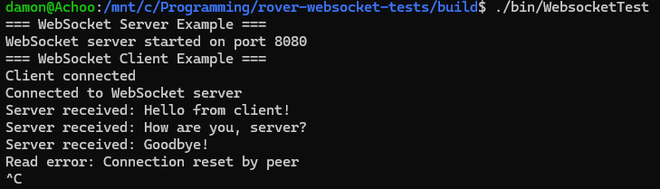

## To Create:

1. Make sure boost is installed and verify it was installed correctly

```bash
sudo apt install libboost-all-dev
ls /usr/include/boost/
```

2. Make sure cmake and make are both installed 
```bash
sudo apt install cmake
sudo apt install make
```

3. Create a build folder in ../rover-websocket-tests
```bash
mkdir build && cd build
```

4. Make the tests using cmake
```bash
cmake ..
```

5. Then make the tests using make
```bash
make
```

6. Finally, run the program
```bash
./bin/WebsocketTest
```

7. Output should look something like this:
